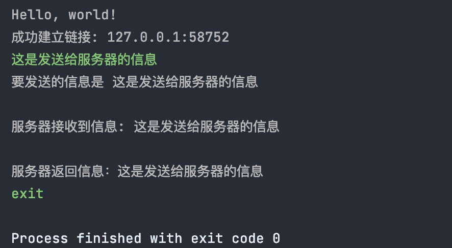

## 第三课作业

运行结果：



## tcp_server.rs

```rust
use std::net::{TcpListener, TcpStream};
use std::thread;
use std::io::{Read, Write, Error, BufRead, BufReader, };
use std::str;
// 处理client时间
pub fn handle_client(mut stream: TcpStream) -> Result<(), Error> {
    println!("成功建立链接: {}", stream.peer_addr()?);

    // 开辟接收信息buf空间
    let mut buf = [0; 512];
    loop {
        // 读取数据流
        let bytes_read = stream.read(&mut buf)?;

        //读取为0输出流结束
        if bytes_read == 0 {
            return Ok(());
        }

        println!("服务器接收到信息: {}", str::from_utf8(&buf[..bytes_read])
            .expect("无法转换信息为字符串"));

        // 返回具体信息
        stream.write(&buf[..bytes_read])?;
    }
}

pub fn run() {
    // 建立tcp链接，开启端口8888
    let listener = TcpListener::bind("0.0.0.0:8888")
        .expect("无法实现链接");

    // 监听数据流
    for stream in listener.incoming() {
        match stream {
            // 如果发生错误，打印错误信息
            Err(e) => { eprintln!("failed: {}", e) }

            // 成日则执行handler方法，处理client 消息
            Ok(stream) => {
                thread::spawn(move || {
                    handle_client(stream)
                        .unwrap_or_else(|error| eprintln!("{:?}", error));
                });
            }
        }
    }
}


```


### tcp_client

```rust
use std::net::TcpStream;
use std::str;
use std::io::{self, BufRead, BufReader, Write};

pub fn run(){

    // 开启tcp链接
    let mut stream = TcpStream::connect("127.0.0.1:8888")
        .expect("无法链接server");

    loop{
        // 建立输入流String
        let mut input = String::new();
        //使用buffer存储输入流并且作为发送Server
        let mut buffer: Vec<u8> = Vec::new();
        io::stdin().read_line(&mut input)
            .expect("读取IO失败");

        //输入exit 结束
        match input.trim() == "exit"{
            true => break,
            _ => {
                println!("要发送的信息是 {}", input);
            },
        }

        // 把输入流数据发送给server
        stream.write(input.as_bytes())
            .expect("链接服务失败");

        // 建立返回接收的buf
        let mut reader = BufReader::new(&stream);

        // 读取服务器返回数据
        reader.read_until(b'\n', &mut buffer)
            .expect("无法读取服务器返回信息");

        //打印对应信息
        print!("服务器返回信息：{}", str::from_utf8(&buffer)
            .expect("无法转换信息为字符串"));

    }
}


```